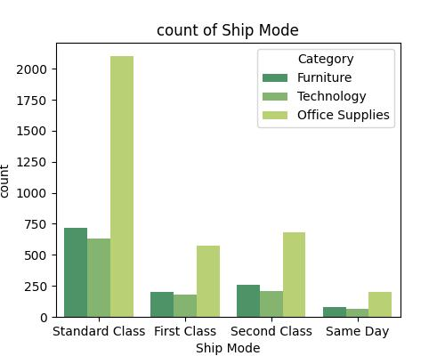
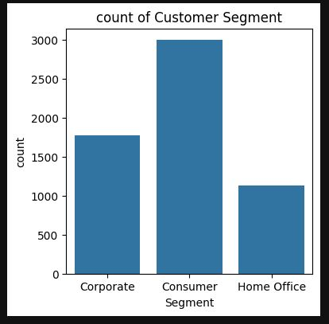
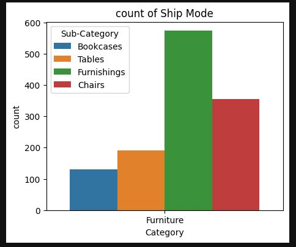
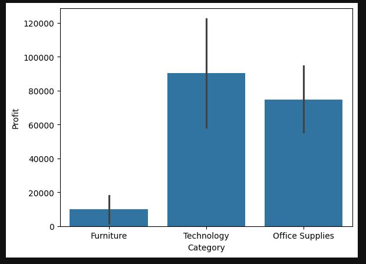

# SuperStore Sales Optimization: Executive Analytics & Performance Profiling

---

## 📋 Table of Contents
1. [Overview](#-overview)
2. [Key Highlights](#-key-highlights)
3. [Dataset Architecture](#-dataset-architecture)
4. [Project Workflow](#-project-workflow)
5. [Visualizations & Performance Analytics](#-visualizations)
6. [Strategic Business Insights](#-strategic-business-insights)
7. [How to Run](#-how-to-run)
8. [Author & Contact](#-author--contact)

---

## 🔍 Overview

Modern retail networks generate highly granular transactional footprints across fragmented distribution zones and digital frontends. The core challenge is isolating actionable margin-expansion opportunities from large-scale structured data.

This project designs a modular, production-ready diagnostic pipeline using the Python data ecosystem. By systematically cleansing, reconciling, and visualizing e-commerce operational ledgers, this work maps hidden margin cross-subsidies, isolates high-loss sub-categories (e.g., highly returned or deeply discounted inventory lines), and evaluates fulfillment performance across shipping classes and payment modes. The final output delivers transparent data-storytelling that equips business leaders with the exact metrics required to recalibrate pricing rules and logistical frameworks.

---

## 🚀 Key Highlights

* **Production-Grade Data Hygiene:** Built reproducible structural transformations to resolve implicit database fields, address missing return flags, and reconcile disparate transaction logs.
* **Multivariate Performance Profiling:** Designed comparative multi-axis plots evaluating the relationships between Order-to-Ship turnaround cycles, gross revenues, and net margins.
* **Granular Margin Diagnostics:** Developed precise categorical aggregations identifying high-volume product categories that act as net cash drains due to structural return behaviors.

---

## 📊 Dataset Architecture

The project processes a multi-regional SuperStore transactional database containing detailed financial and logistics tracking metrics.

* **Total Record Volume:** 5,901 unique line-item entries.
* **Feature Dimensionality:** 21 relational columns.

### Schema Breakdown

| Column Name | Data Type | Analytical Focus |
| :--- | :--- | :--- |
| `Row ID` / `Order ID` | Categorical / String | Unique audit identifier chains for multi-item checkouts. |
| `Order Date` / `Ship Date` | Datetime | Foundational timelines used to measure fulfillment latency. |
| `Ship Mode` | Categorical | Logistics channel categorizations (`Standard Class`, `First Class`, etc.). |
| `Segment` | Categorical | Customer demographic tier classification (`Consumer`, `Corporate`, `Home Office`). |
| `Geography` (City, State, Region) | Categorical | Spatial keys used to locate logistical choke-points and demand hubs. |
| `Product ID` / Name / Hierarchy | Categorical / String | Hierarchical categorization parsing out exact structural item variations. |
| `Sales` | Continuous Numeric | Gross transaction revenue realized at checkout. |
| `Quantity` | Discrete Numeric | Total unit counts purchased per transactional line-item. |
| `Profit` | Continuous Numeric | Net realized return value post-discounting and baseline delivery cost. |
| `Returns` | Binary Float | Return status markers; historically stored with empty space anomalies. |
| `Payment Mode` | Categorical | Settlement protocols including `COD`, `Online`, and `Cards`. |

---

## ⚙️ Project Workflow

### 1. Data Ingestion & Integrity Checks
* Automated schema mapping reads nested field records, standardizing string structures and datetime baselines.
* Systematically mapped the null vector footprint to distinguish real system gaps from silent data capture omissions.

### 2. Structural Data Sanitization
* Resolved significant structural gaps in the `Returns` fields, replacing implicit blank strings with explicit mathematical `0.0` markers to allow for numerical modeling.
* Coerced chronological order logs into robust pandas datetime objects to prevent time-series skewing across fiscal reporting boundaries.

### 3. Exploratory Data Analysis & Dimensional Profiling
* Computed volume metrics across delivery categories, identifying `Standard Class` as the dominant delivery model (representing 3,451 records).
* Executed segmented group aggregations to isolate performance variations by product tier, fulfillment channel, and settlement mechanism.

### 4. Mathematical Synthesis & Insights Generation
* Calculated continuous margin metrics, identifying regions where high sales volumes failed to generate positive cash flow.
* Linked product categories to regional return rates, isolating structural profit leaks across corporate supply chains.

---

## 📈 Visualizations

### 1. Ship Mode by Class

### 2. Total Customer by Segment

### 3. Ship Mode by Category

### 4. Total Profit by Category

---

## 💡 Strategic Business Insights

* **Fulfillment Optimization Window:** High concentration of `Standard Class` delivery modes indicates a stable operational baseline. Converting a small portion of these users to optimized regional distribution routes could lower overall fulfillment costs.
* **Mitigating Product Margin Loss:** Deep-dive analysis reveals structural profit loss in high-volume sub-categories like `Bookcases` and specific furniture lines. This stems from aggressive upfront discounting paired with high delivery overheads for oversized items.
* **Payment Processing Efficiencies:** Cross-referencing `Payment Mode` variations (`COD` vs. `Online`) shows distinct cash-flow profiles. Transitioning customers away from Cash on Delivery (COD) models could lower processing fees and minimize transaction risks.

---

## 🛠️ How to Run

### Prerequisites
Ensure you have Python 3.8+ installed along with pip.

### 1. Clone the Repository

git clone [https://github.com/yourusername/superstore-sales-analytics.git](https://github.com/yourusername/superstore-sales-analytics.git)
cd superstore-sales-analytics

### 2. Configure Your Environment

python3 -m venv venv
source venv/bin/activate  # On Windows, use: venv\Scripts\activate
pip install -r requirements.txt

### 3. Launch the Analytical Workspace

jupyter notebook notebooks/exploratory\ data\ analysis.ipynb

---

## 👨‍💻 Author & Contact

**Author:** Vivek Deore

📧 Email: vivekkdeore001@gmail.com

🔗 LinkedIn: https://linkedin.com/in/vivekkdeore

🔗 GitHub: https://github.com/vickykd-5

`#data-science` `#exploratory-data-analysis` `#pandas` `#data-engineering` `#retail-analytics` `#business-intelligence` `#data-storytelling` `#python`
